# Suicidal Ideation Detection Using Deep Learning

[](https://www.python.org/)
[](https://pytorch.org/)
[](https://www.tensorflow.org/)
[](https://jupyter.org/)
[](https://developer.nvidia.com/cuda-zone)


This project explores how domain-aware language representations can improve suicidal ideation detection on social media text. It compares a strong reimplemented baseline against a MentalBERT-based hybrid model, with a focus on classification quality, training efficiency, and cross-dataset generalization.

The repository was built as a Final Year Project and includes the full experiment workflow, analysis notebooks, and report-driven visualizations used to evaluate the models on Reddit and Twitter-derived datasets.

The main question is whether a mental-health-aware encoder can improve classification quality while remaining efficient enough to reduce training cost and memory usage.

The headline result is based on 30 repeated seeds with 5-fold cross-validation, supported by hypothesis testing to check whether the proposed model's gains are statistically meaningful rather than due to a favorable split.

## Table of Contents

- [Key Features](#key-features)
- [Tech Stack](#tech-stack)
- [Experiment Environment](#experiment-environment)
- [Datasets Used](#datasets-used)
- [Architecture](#architecture)
- [Baseline and Enhancement](#baseline-and-enhancement)
- [Metrics Used](#metrics-used)
- [Experiment Design](#experiment-design)
- [Model Results](#model-results)
- [Model Visualization](#model-visualization)
- [Repository Structure](#repository-structure)
- [How to Run](#how-to-run)
- [Reference](#reference)

## Key Features

- Reimplements the AL-BTCN baseline from Mirtaheri et al. (2024) for a reproducible comparison.
- Introduces a MentalBERT-based feature extraction pipeline to capture domain-specific mental health language.
- Evaluates multiple design choices such as precomputed embeddings, fine-tuning, pooling strategy, optimizer selection, Layer Normalization, and preprocessing variants.
- Uses early stopping and hypothesis testing to analyze generalization and overfitting across runs.
- Benchmarks both accuracy quality and system efficiency, including training time and GPU memory usage.
- Extends evaluation across multiple datasets to study transfer behavior under different social media domains.

## Tech Stack

- Python 3.11
- PyTorch for MentalBERT embedding extraction
- TensorFlow / Keras for the downstream TCN-LSTM classifier
- Hugging Face Transformers
- NumPy, Pandas, scikit-learn
- Matplotlib, Seaborn
- Jupyter Notebook
- CUDA-enabled GPU training

## Experiment Environment

The experiments were run in a Google Colab Pro environment. The platform summary below captures the runtime setup used for the project.

| Setting | Value |
| --- | --- |
| Programming Language | Python |
| Python Version | 3.11.13 |
| Code Development IDE | Jupyter Notebook |
| Google Colab Plan | Pro |
| Google Colab Release Version | 2025-07-22 |
| RAM | 53.0 GB |
| GPU | Intel(R) Xeon(R) CPU @ 2.20GHz |
| GPU RAM | 22.5 GB |
| Disk Space | 235.7 GB |
| Operating System | Ubuntu |
| Ubuntu Version | 22.04.4 LTS |

## Datasets Used

The project evaluates suicidal ideation classification on four social media datasets:

- Twitter 1: 9,119 tweets, 56.2% non-suicidal and 43.8% suicidal.
- Reddit: Reddit text with 47.8% non-suicidal and 52.2% suicidal samples.
- Twitter2: 26,776 tweets, balanced 50% non-suicidal and 50% suicidal.
- RedditSNS: 10,000 Reddit-style posts, balanced 50% non-suicidal and 50% suicidal.

## Architecture

The project follows a two-stage design:

1. Feature extraction with MentalBERT
	- Input text is tokenized and passed through MentalBERT.
	- The model supports both pooled output and sequence output experiments.
	- Precomputed embeddings are used in the most efficient configuration to reduce runtime.

2. Downstream classifier with TCN-LSTM
	- Embeddings are expanded into sequence form.
	- The classifier uses SpatialDropout1D, CuDNNLSTM, bidirectional TCN blocks, custom attention, global pooling, concatenation, dense layers, dropout, and a sigmoid output head.

The architecture diagram below summarizes the full pipeline.

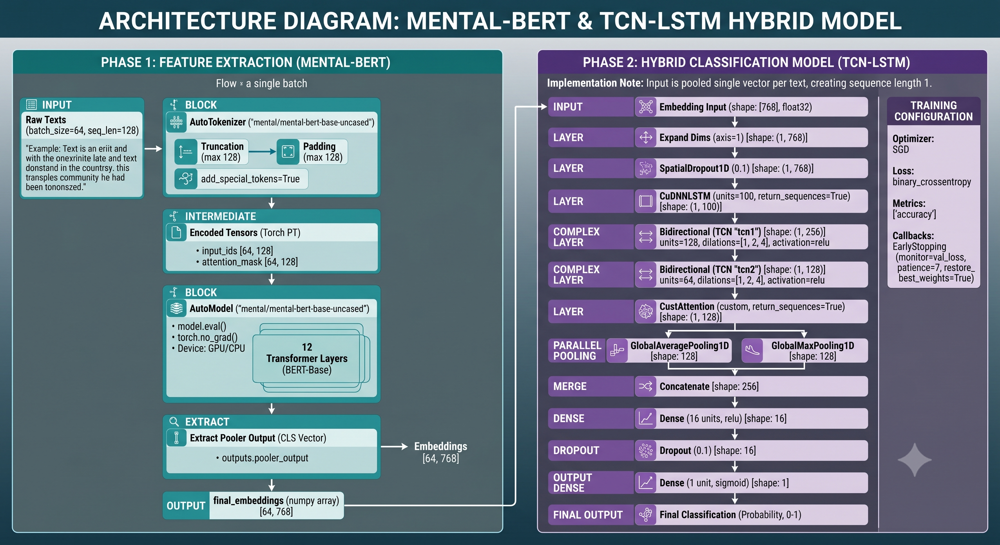

## Baseline and Enhancement

- Original model: AL-BTCN by Mirtaheri et al. (2024).
- Gap addressed: the baseline relies on more generic representations and is expensive to train, while also showing overfitting in several settings.
- Enhancement: MentalBERT_Precompute_Pool_ES, which combines MentalBERT embeddings, pooled representations, precomputation, and early stopping.
- Why it matters: the enhanced pipeline keeps the model competitive on Reddit-family datasets while cutting compute cost dramatically.

## Metrics Used

- Accuracy
- Precision
- Recall
- F1-score
- Training time
- Maximum GPU memory usage
- Average GPU utilization

## Experiment Design

The experiments were designed to test both robustness and practical efficiency:

- 30 repeated seeds were used with 5-fold cross-validation to reduce variance from any single train/test split.
- Hypothesis testing was applied to the repeated runs to check whether proposed-vs-baseline differences were statistically meaningful.
- The comparison includes performance metrics as well as training time and GPU memory usage.
- The same evaluation setup was applied across Twitter and Reddit-family datasets to observe how strongly the models transfer across domains.

## Model Results

The consolidated 30-seed, 5-fold cross-validation summary is shown below. It aggregates repeated runs across 30 random seeds and 5 folds, which makes the reported performance more robust and less dependent on a single split.

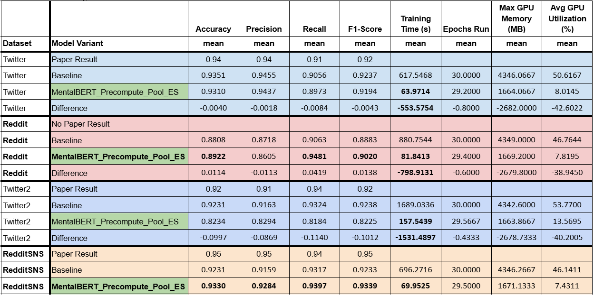

Hypothesis testing was carried out on the repeated runs to validate whether the observed differences between the baseline and proposed model were statistically meaningful rather than random variation.

### Key Outcomes

- Reddit: F1 improved from 0.8883 to 0.9020, with recall improving from 0.9063 to 0.9481.
- RedditSNS: F1 improved from 0.9233 to 0.9339, with recall improving from 0.9317 to 0.9397.
- Twitter and Twitter2 did not show the same gains, which highlights the domain-shift challenge across platforms.
- Training time was reduced by roughly 90% across all four datasets.
- GPU memory usage dropped from about 4.3 GB to about 1.7 GB.

### Efficiency Comparison

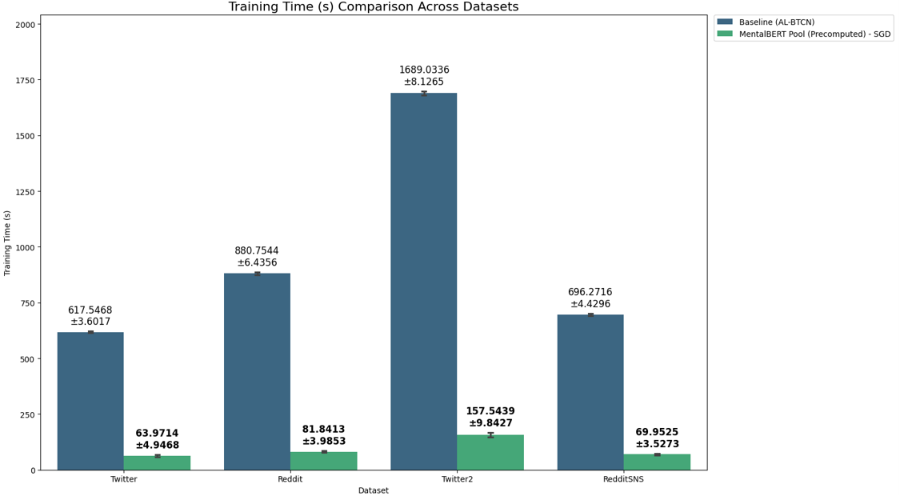

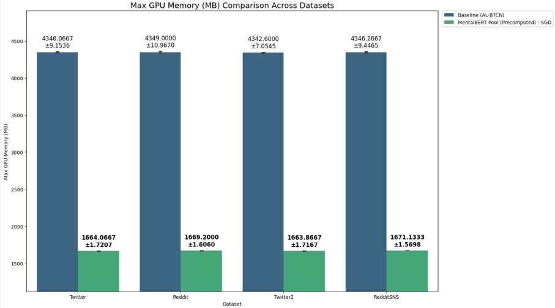

### Learning Curves

The figures below show baseline and proposed training/validation curves for each dataset. Together, they make it easier to inspect convergence behavior, overfitting, and where the proposed model becomes more stable or more efficient than the baseline.

<details>
<summary><strong>Twitter</strong></summary>

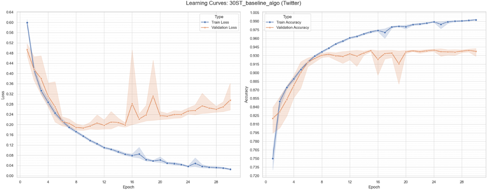

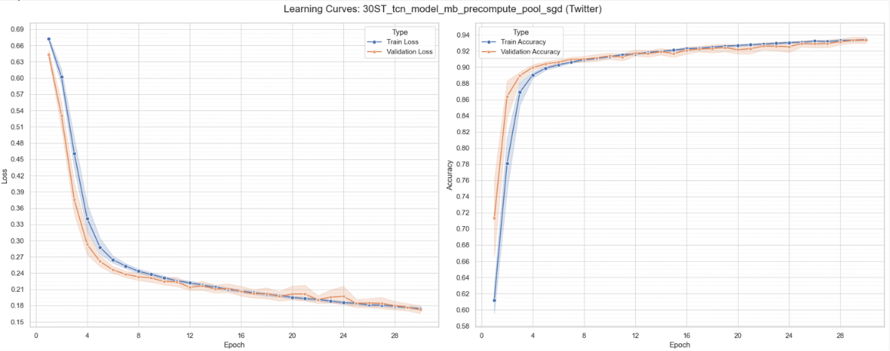

</details>

<details>
<summary><strong>Reddit</strong></summary>

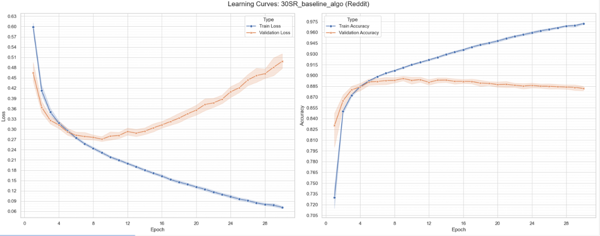

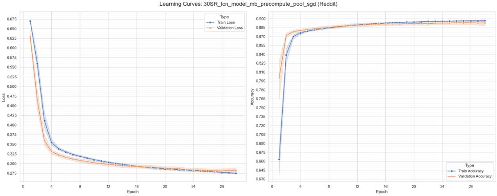

</details>

<details>
<summary><strong>Twitter2</strong></summary>

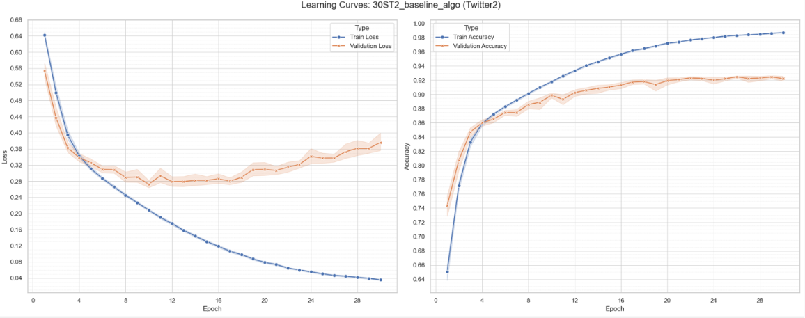

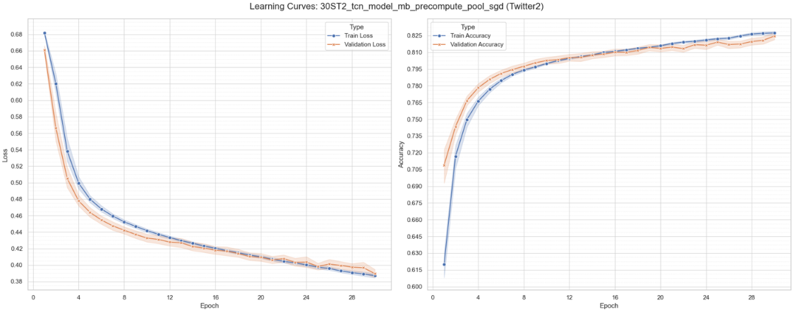

</details>

<details>
<summary><strong>RedditSNS</strong></summary>

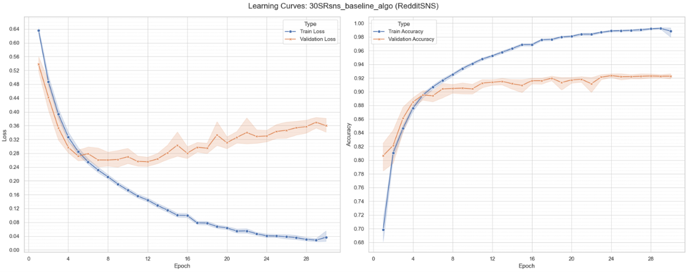

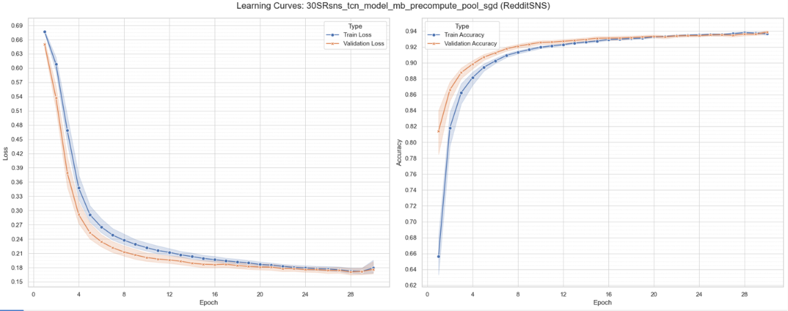

</details>

## Model Visualization

The README includes the most relevant learning curves from `ReadME-Images/` so the training dynamics are visible at a glance. Additional learning-curve and ablation figures are stored in the repository under `Results/` and `ReadME-Images/` for deeper inspection.

## Repository Structure

```text
FYP-Suicidal-Ideation-Detection-UsingDL/
├── Scripts/                  # Training and exploration notebooks
├── Results/                  # Experiment outputs and visual analysis notebooks
├── Datasets/                 # Dataset analysis utilities
├── ReadME-Images/            # Curated figures used in this README
├── env_packages.txt          # Environment dependency list
```

## How to Run

1. Create a Python 3.11 environment.
2. Install the dependencies listed in `env_packages.txt`.
3. Open the notebooks under `Scripts/` or `Results/` to reproduce the experiments.
4. Primary execution platform: Google Colab Pro with T4 GPU, using a GPU runtime and running the notebooks end-to-end after uploading the required datasets.

## Reference

- Mirtaheri et al. (2024), AL-BTCN baseline for suicidal ideation detection.
